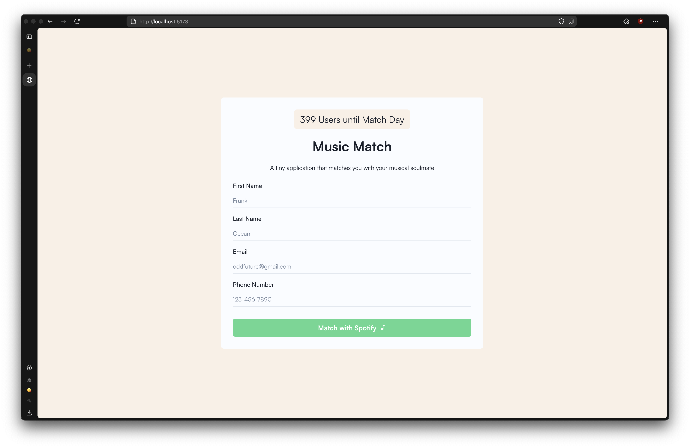
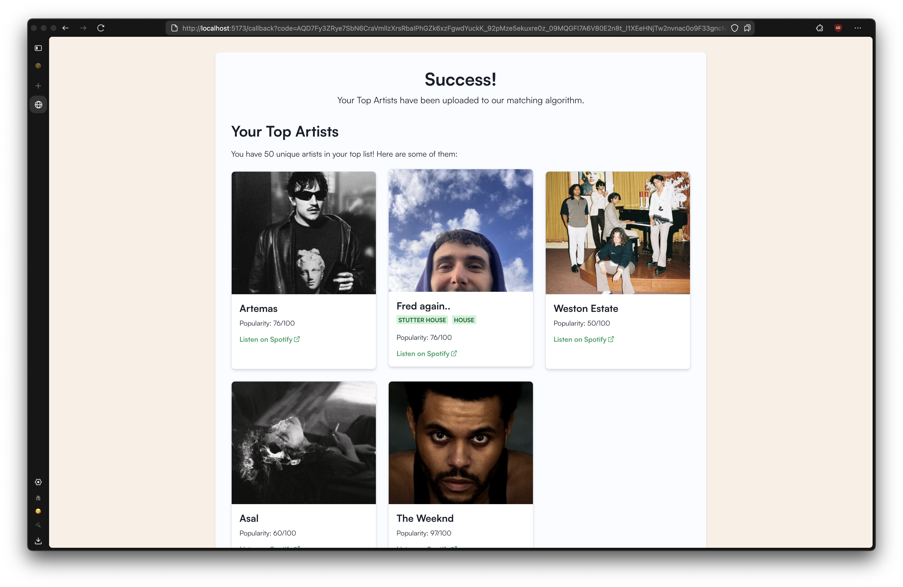

# Music Match

A web application that matches users based on their music preferences and connects them with each other.

## Project Overview

Music Match is a full-stack application that allows users to:

1. Sign up with their personal information
2. Connect their Spotify account to share their top artists or manually submit
3. Get matched with other users who have similar music tastes
4. Receive email notifications with their match's contact information

The application uses a matching algorithm based on cosine similarity and Edmond's blossom algorithm 
to maximally match users with similar music preferences.

## System Architecture

The application consists of three main components:

1. **Frontend**: A React-based web interface for user registration and Spotify authentication
2. **Backend**: A Go server that handles API requests, Spotify integration, and database operations
3. **Matching System**: Python scripts that analyze user data, match users, and send email notifications

## Components

### Frontend (UI)

The frontend is built with React and Chakra UI, and uses Vite.js as the build system. Key features include:

- User registration form with validation
- Dual artist submission options:
  - Spotify authentication integration
  - Manual artist selection without requiring Spotify
- Artist search functionality
- Display of user's top artists after successful authentication
- Real-time counter showing how many more users are needed until the next match day





### Backend

The backend is implemented in Go using the Connect RPC framework. It provides the following services:

- Spotify authentication and token management
- Retrieval and storage of user's top artists from Spotify API
- User data management in a PostgreSQL database
- API endpoints for the frontend to interact with
- Artist search and self-submission (without requiring Spotify authentication)

#### Artist Database Population

To support manual artist selection, you can seed the artist database ahead of time:

```bash
cd backend

# Set required environment variables
export SPOTIFY_CLIENT_ID=your_spotify_client_id
export SPOTIFY_CLIENT_SECRET=your_spotify_client_secret
export DB_HOST=localhost:5432
export DB_USERNAME=spotifyuser
export DB_NAME=spotify
export DB_PASSWORD=your_password

# Build and run the script
go build -o populate-artists cmd/populate_artists/main.go
./populate-artists
```

This script uses Spotify's API to collect artist information by searching common letters and combinations.

### Matching System

The matching system consists of Python scripts that:

1. **matching.py**: Analyzes user data and matches users based on their music preferences using:
   - Cosine similarity to measure the similarity between users' music tastes
   - Rustworkx for efficient graph-based maximum weight matching
   - Exports match results to CSV files

2. **send_match_emails.py**: Sends personalized email notifications to matched users with:
   - Contact information of their match
   - Their match score
   - List of common artists they share

## Database Schema

The application uses a PostgreSQL database with the following tables:

- **users**: Stores user information (name, email, phone number)
- **artists**: Stores artist information from Spotify
- **user_artists**: Maps users to their top artists with ranking information

## Setup and Installation

### Prerequisites

- Go 1.16+
- Node.js 14+
- Python 3.6+
- PostgreSQL database
- Spotify Developer account
- Mailgun account (for sending emails)

### Backend Setup

1. Set up the PostgreSQL database:
   ```bash
   psql -U postgres -f backend/sql/create_tables.sql
   ```

2. Configure environment variables for Spotify API credentials

3. Run the backend server:
   ```bash
   cd backend
   air
   ```

### Frontend Setup

1. Install dependencies:
   ```bash
   cd ui
   npm install
   ```

2. Run the development server:
   ```bash
   npm run dev
   ```

### Matching System Setup

1. Install required Python packages:
   ```bash
   pip install psycopg2 rustworkx numpy scipy scikit-learn requests
   ```

2. Set up Mailgun for email notifications:
   - Create a Mailgun account
   - Verify your domain
   - Get your API key

## Usage

### User Registration and Authentication

Users have two options for registration:

#### Manual Artist Selection
1. Users fill out the registration form and select "Select Artists Manually"
2. They can search for artists using the search functionality
3. Selected artists are added to their list (up to 10 artists)
4. Users can arrange their artists in order of preference
5. Upon submission, their selections are stored in the database

#### Spotify Connection
1. Users fill out the registration form and select "Connect with Spotify"
2. Upon submission, they are redirected to Spotify for authorization
3. After authorization, their top artists are automatically retrieved and stored

### Matching Process

1. When enough users have registered, run the matching script:
   ```bash
   python matching/matching.py
   ```

2. Send email notifications to matched users:
   ```bash
   python matching/send_match_emails.py path/to/matches.csv \
     --api-key YOUR_MAILGUN_API_KEY \
     --domain YOUR_MAILGUN_DOMAIN \
     --sender "Spotify Match <matches@yourdomain.com>" \
     --template matching/email_template.txt
   ```

## Technologies Used

- **Frontend**: React, Chakra UI, Vite
- **Backend**: Go, Connect RPC
- **Database**: PostgreSQL
- **Matching Algorithm**: Python, NumPy, SciPy, Rustworkx
